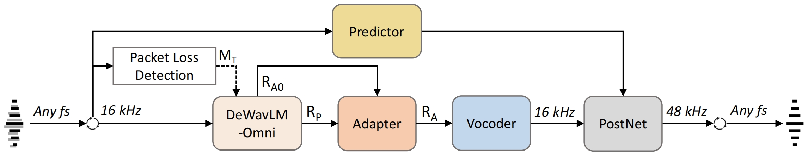
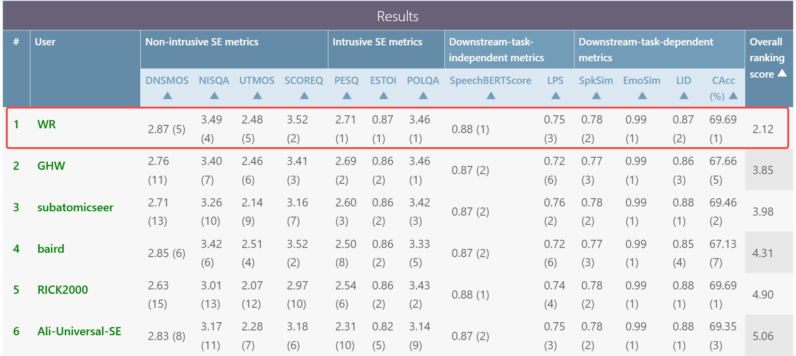

# GAP-URGENet
[](https://arxiv.org/abs/2604.01832)
[](https://xiaobin-rong.github.io/gap-urgenet_demo/)
[](https://huggingface.co/Xiaobin-Rong/gap-urgenet)

This is the official implementation of GAP-URGENet, a state-of-the-art (SOTA) universal speech enhancement (USE) model.



GAP-URGENet ranked **1st** in the objective evaluation phase of the **ICASSP 2026 URGENT Challenge** (team WR).



**Note**: This repo only provides the training scripts for the Predictor and PostNet, as the generative branch (DeWavLM-Omni + Adapter + Vocoder) has already released in our other repo [UniPASE](https://github.com/Xiaobin-Rong/unipase).

## Pretrained Checkpoints
We provided the original checkpoints for the URGENT 2026 Challenge:
- `DeWavLM-Omni.pt`
- `Adapter.pt`
- `Vocoder.pt`
- `Predictor.pt`
- `PostNet.pt`

**Note**: These checkpoints differ from those provided in [UniPASE](https://github.com/Xiaobin-Rong/unipase), as all models here were trained on the official training corpora released for the URGENT 2026 Challenge.

## Inference

To run inference on audio files, use:
```bash
python -m inference.inference -I <input_dir> -O <output_dir> [options]
```

For long-form audio inputs (e.g., > 20s), use:
```bash
python -m inference.inference_long -I <input_dir> -O <output_dir> [options]
```


| Argument       | Requirement / Default | Description                                                                 |
|----------------|-----------------------|-----------------------------------------------------------------------------|
| `-I` (`--input_dir`)  | **required**          | Path to the input directory containing audio files.                   |
| `-O` (`--output_dir`) | **required**          | Path to the output directory where enhanced files will be saved.      |
| `-D` (`--device`)     | default: `cuda:0`     | Torch device to run inference on, e.g., `cuda:0`, `cuda:1`, or `cpu`. |
| `-E` (`--extension`)  | default: `.wav`       | Audio file extension to process.                                      |
| `--sr_out`            | default: `None`       | Output sampling rate (default: same as input)                         |
| `--enable_plc`        | default: `True`       | Whether to perform packet loss concealment (PLC)                      |

Audio examples can be found in `./audio`.


## Training
### Step 1: Train the generative branch
Please see [UniPASE](https://github.com/Xiaobin-Rong/unipase) for training scripts and instructions on:

1. Finetune WavLM

2. Train a Vocoder

3. Train an Adapter


### Step 2: Train the Predictor
- training script: `train/train_predictor.py`
- training configuration: `configs/cfg_train_predictor.yaml`
    ```bash
    python -m train.train_predictor -C configs/cfg_train_predictor.yaml -D 0,1,2,3,4,5,6,7
    ```

### Step 3: Train the PostNet
- training script: `train/train_postnet.py`
- training configuration: `configs/cfg_train_postnet.yaml`


## Creating Checkpoints
Once all training steps are completed, the corresponding checkpoints can be prepared for inference:

- `utils/create_ckpt_wavlm.py` is used to create a DeWavLM-Omni checkpoint.
- `utils/create_ckpt.py` is used to create other checkpoints.

## Citation
If you find this work useful, please cite our paper:
```bibtex
@INPROCEEDINGS{GAP-URGENet,
  author={Rong, Xiaobin and Wang, Yushi and Wang, Zheng and Lu, Jing},
  booktitle={ICASSP 2026 - 2026 IEEE International Conference on Acoustics, Speech and Signal Processing (ICASSP)}, 
  title={{GAP-URGENet: A Generative-Predictive Fusion Framework for Universal Speech Enhancement}}, 
  year={2026},
  volume={},
  number={},
  pages={21895-21897},
  keywords={speech enhancement;URGENT challenge;generative model;predictive model;fusion},
  doi={10.1109/ICASSP55912.2026.11463702}}

```

## Contact
Xiaobin Rong: [xiaobin.rong@smail.nju.edu.cn](mailto:xiaobin.rong@smail.nju.edu.cn)